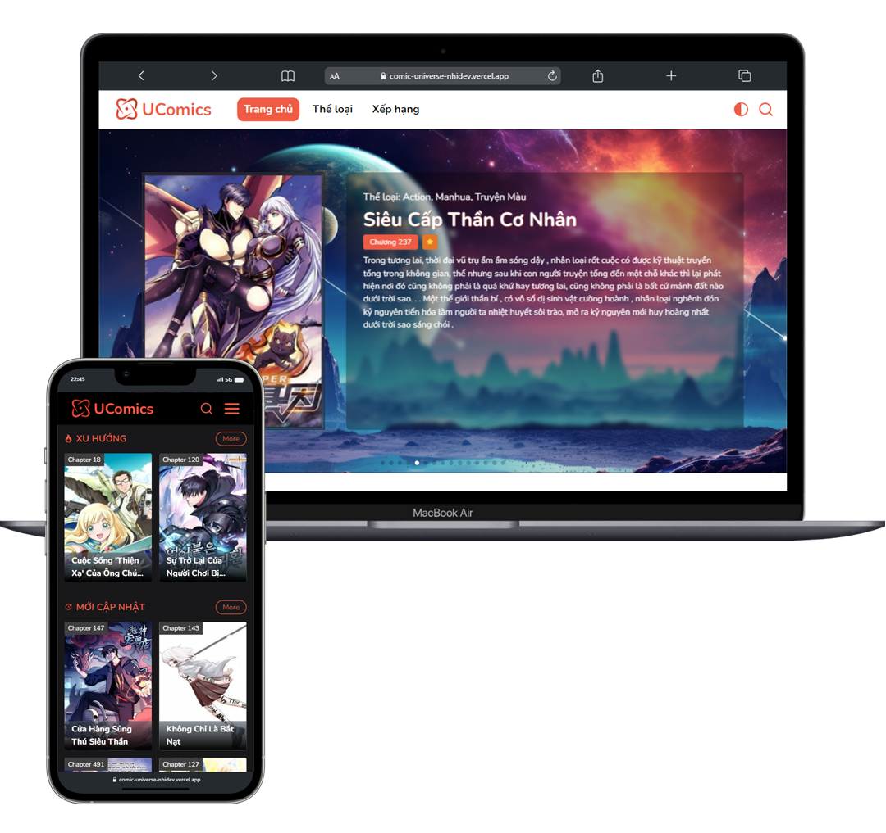

<h2 align="center">
  UComics - <a href="https://nhideveloper.id.vn" target="_blank">Nhideveloper</a>
</h2>

  

<h2 align="center">
    🔹
    <a href="https://comic-universe-nhidev.vercel.app/">Demo</a>
</h2>

 
 

## Decription

This is a comic reading website that I created during the process of learning to call APIs and using Redux.

## Built With

This project was built using these technologies.

- Vite
- React.js
- TailwindCSS
- CSS3
- Swiper
- Axios
- Redux toolkit
- Rest Apis
- VsCode
- Vercel

## Feature

**🌗 Dark Mode**

**📚 Filter Comics**

**🔎 Search Comics**

**️🏅 Ranking Comics**

**🖼️ 3D Effect**

**📱 Fully Responsive**

## Other

Source API: <a href="https://comics-api.vercel.app/">https://comics-api.vercel.app</a> by pth-1641.
